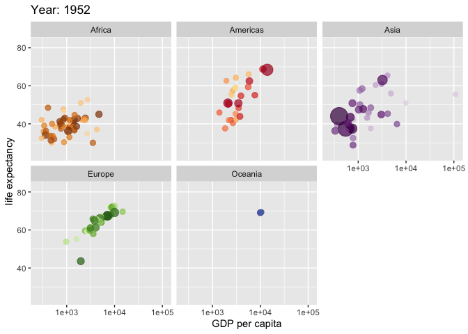

```{r xaringan-themer, include = FALSE}
library(xaringanthemer)
# duo(primary_color = "#004d67", 
#     secondary_color = "#fbcd28")
mono_accent(
  base_color = "#004d67",
  # base_color = "#00b6dc",
  # base_color = "#fbcd28",
  header_font_google = google_font("Muli"),
  text_font_google   = google_font("Muli", "300", "300i"),
  code_font_google   = google_font("Droid Mono")
)
```
# R is a great tool for data analysis!

.pull-left[
Why to use R for data analysis / data science:

- Reproducibility

- Quality (>10k packages)

- Flexibility

- Community
]

--

.pull-right[
```{r  out.width = "80%", echo=FALSE}
 
```
]

---
# Ways of sharing your results:

--
- Reports for your boss/client/teacher/colleagues
- Presentations for your boss/clients/teacher/colleagues
- Articles (Academic journals, press, blog posts)
- Books, Thesis
- Others


---
# Software for writing

--
- Most of us started and still use Word processors (Ms Word, Libreoffice, )
  - Formatted text 

--
- LaTeX is very popular in some areas (Mostly academia)
  - Plain text with markup tagging (i.e. \textbf{Bold text})

--
- Markdown (increasing popularity)
  - Plain text with lightweight markup tagging (i.e. `**text**`)

--
- Markdown flavours 
  - i.e. Pandoc for extended features such as tables, figures, quotes

--

> A Markdown-formatted document should be publishable as-is, as plain text, without looking like it’s been marked up with tags or formatting instructions. – John Gruber

---
# But why?

- A markdown file is a plain text file. No format issues/license issues/software version/software availability issues.

- Since is text file, you can use version control (git/subversion), or other diff/merge tools (meld,...)

- Exportability. The same file can easily be converted to word/pdf/html or even a presentation.

---
# Comparison with other systems

--
- RMarkdown vs MS Word or MS Powerpoint.

--
- RMarkdown vs $\LaTeX$

--
- RStudio vs Texmaker, TexnicCenter, TexStudio,... 
  - Pro tip; use "infinite moon reader" for automatic display of HTML.

--
- RStudio vs Overleaf, Authorea.
  - Pro tip: Use github.com

---
class: inverse, center, middle

# Live example

---
# The R flavoured Markdown

- R Markdown uses Pandoc
- Integrated with RStudio
- Integrated with R 
- Same notation, different outputs: .html, .docx, .pdf, .odt, etc. 

---
# Rmarkdown notation

You can use inline format for text:

- Italic with `_text_` or `*text*`: *Italic text*
- Bold with `**text**`: **Bold text**
- Hyperlinks with `[text](link)`, e.g., [cdv](https://cdv.pl/).
- Images with ``

. 

<!-- --- -->
<!-- .right[] -->
<!-- .left[] -->
<!-- .center[] -->
<!-- .top[.right[]] -->
<!-- .right[] -->

---
# Rmarkdown notation

- Section headers can be written after a number of pound signs, e.g.,

```markdown
# First-level header

## Second-level header

### Third-level header
```
# First-level header

## Second-level header

### Third-level header

---
# Lists 

Unordered list items start with `*`, `-`, or `+`, and you can nest one list within another list by indenting the sub-list, e.g.,

```markdown
- one item
- one item
- one item
    - one more item
    - one more item
    - one more item
```

The output is:

- one item
- one item
- one item
    - one more item
    - one more item
    - one more item

---
# Lists 

Ordered list items start with numbers (you can also nest lists within lists), e.g.,

```markdown
1. the first item
2. the second item
3. the third item
    - one unordered item
    - one unordered item
```

The output does not look too much different with the Markdown source:

1. the first item
2. the second item
3. the third item
    - one unordered item
    - one unordered item
    
---
# Quotes 

Blockquotes are written after `>`, e.g.,

```markdown
> "I thoroughly disapprove of duels. If a man should challenge me, 
> I would take him kindly and forgivingly by the hand 
> and lead him to a quiet place and kill him."
>
> --- Mark Twain
```

> "I thoroughly disapprove of duels. If a man should challenge me,
  I would take him kindly and forgivingly by the hand and lead him
  to a quiet place and kill him."
>
> --- Mark Twain

---
# Formulas

- Equations can be written using LaTeX notation 
- Inline equations should be enclosed into dollar signs:
  - You write `$\int_{1}^{x}(2-u^2)du$`
  - You get $\int_{1}^{x}(2-u^2)du$
- Display style should be enclosed into double dollar signs:
  - You write 
  ```
  $$\int_{1}^{x}(2-u^2)du$$
  ```
  
  - You get $$\int_{1}^{x}(2-u^2)du$$
  
---
# R code

- This is the best advantage to write your documents in R Markdown: Your report is directly connected to your data analysis!

````markdown
`r ''````{r}
x <- rnorm(100)
summary(x)
```
````

### Output:

```{r}
x <- rnorm(100)
summary(x)
```

---
.pull-left[

### Input: 

````markdown
`r ''````{r}
y <- rnorm(100)
plot(x,y)
```
````
]
.pull-right[

### Output:

```{r}
y <- rnorm(100)
plot(x,y)
```
]

---
# Tables

You can use the kable and kableExtra packages for tables:

.pull-left[

### Input: 

````markdown
`r ''````{r}
library(knitr)
library(kableExtra)
dt <- mtcars[1:5, 1:6]
dt %>%
  kable()
```
````
]
.pull-right[

### Output:

```{r, echo = FALSE, message = FALSE}
library(knitr)
library(kableExtra)
dt <- mtcars[1:5, 1:6]
dt %>%
  kable()
```
]

---
# Maps

````markdown
`r ''````{r, echo = F}
library(leaflet)
leaflet() %>% addTiles() %>% setView(16.933685, 52.408137, zoom = 17)
```
````

```{r, echo = F, fig.width=12, fig.height=5}
library(leaflet)
leaflet() %>% addTiles() %>% setView(16.933685, 52.408137, zoom = 17)
```

---
class: center, middle
## Advantages of HTML solutions (html, ioslides, slidy)

---
### Interactive plots

```{r, echo=FALSE, warning=FALSE, message = FALSE}
library(tidyverse)
library(plotly)
library(widgetframe)
x <- seq(-3,3,0.01)
y <- x^2
data <- tibble(x, y)
l <- plot_ly(data=data, x=~x, y=~y)
frameWidget(l, width='100%', height='80%')
```

---
### Shiny applications
<iframe width="1200" height="500" src="http://127.0.0.1:7859" frameborder="0" allow="accelerometer; autoplay; encrypted-media; gyroscope; picture-in-picture" allowfullscreen></iframe>

---
### Animated gifs

- Like this one created by the gganimate package



---
### Animated gifs

- Or just for fun!


---
# RMarkdown extensions

.pull-left[
- RMarkdown is not only for R: Currently the languages supported are R, Python, Julia, Shell, SQL, Rcpp, Stan, Javascript, C, and Fortran.
- Dashboards with the flexdashboard package. [Example](https://jjallaire.shinyapps.io/shiny-biclust/)
- Tufte handouts with the tufte package. [Example](https://rstudio.github.io/tufte/)
- Distill web documents for science reports [Example](https://rstudio.github.io/distill/)
- Reveal.js presentations with the revealjs package. [Example](https://revealjs.com/#/)
- Shower presentations with the rmdshower package. [Example](http://mangothecat.github.io/rmdshower/skeleton.html#shower-presentations-with-r-markdown)
- Remark.js presentations with the xaringan package. Like this one!

]

???

## Hello everyone! Here we see the presenter notes

- Don't forget to click on the links
- So they can see what is possible with RMarkdown extensions
- Of course this is also rmarkdown so you can add more stuff to your presenter notes


--

.pull-right[
<iframe width="600" height="250" src="file:///home/adolfo/Data analysis/Beyond Data Analysis/VI_Reporting.html#1" frameborder="0" allow="accelerometer; autoplay; encrypted-media; gyroscope; picture-in-picture" allowfullscreen></iframe>

- Pressing `p` you get the presenter mode! 
]

---
# RMarkdown extensions
- CVs with the vitae package. [Example](https://github.com/robjhyndman/CV/blob/master/RobHyndmanCV.pdf)

--
- Websites with the blogdown package. [Example](https://robjhyndman.com/)

--
- Packages documentation with the pkgdown package. [Example](https://pkgdown.r-lib.org/)

--
- Books with the bookdown package. [Example](https://bookdown.org/yihui/rmarkdown/)

--
- Journal articles with the rticles package. [Example](https://bookdown.org/yihui/rmarkdown/journals.html).

---
# More tips and extensions at:

- [Cheatsheet](https://www.rstudio.com/wp-content/uploads/2015/02/rmarkdown-cheatsheet.pdf)
- RMarkdown: The definitive guide 

<iframe width="1200" height="600" src="https://bookdown.org/yihui/rmarkdown/" frameborder="0" allow="accelerometer; autoplay; encrypted-media; gyroscope; picture-in-picture" allowfullscreen></iframe>


---
class: center, middle
# Thank you!

```{r, fig.width = 2, echo = FALSE}
# Small fig.width
include_graphics("img/davinci.png")
```

